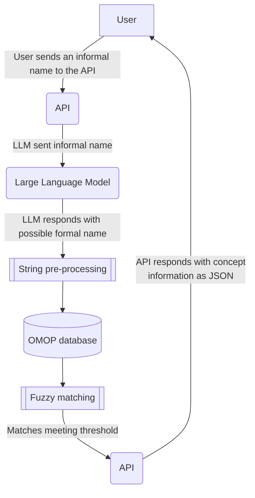

# Llettuce: LLM for Efficient Translation and Transformation into Uniform Clinical Encoding 

**Llettuce** is an application for medical researchers that matches the informal medicine names supplied by the user to concepts in the [Observational Health Data Sciences and Informatics](https://www.ohdsi.org) (OMOP) [standardised vocabularies](https://github.com/OHDSI/Vocabulary-v5.0/wiki)

The application can be used as an API, or run with a graphical user interface (GUI).

   This project is under active development

## Overview

The project uses a Large Language Model to suggest formal drug names to match the informal name supplied by the user. Suggested formal drug names are then fed into parameterised SQL queries against the OMOP database to fetch the relevant concepts. Any returned concepts are then ranked by how well they match the supplied query and provided to the user.

This is the rough process that the Llettuce API follows. Subject to change



## Installation

To use Llettuce, you must first clone the repository

```
$ git clone <url>
$ cd Carrot-Assistant
```

Then install the dependencies, either using pip

```
$ pip install -r requirements.txt
```

or conda

```
$ conda create -f environment.yml
```

There are two ways of interacting with Llettuce: either by using the graphical user interface, or through the command line. Both of these rely on starting a Llettuce server locally, then making requests to this server.
The GUI is useful for people who want to interactively run a few examples and be presented with a visual representation of the relevant OMOP concepts.
The command line can be used if a user is more interested in running Llettuce programmatically and retrieving a large number of concepts.

### Connecting to a database

Llettuce works by querying a database with the OMOP schema, so you should have access to one. Your database access credentials should be kept in `.env`. An example of the format can be found in `/Carrot-Assistant/.env.example`

### Running the API

The simplest way to get a formal name from an informal name is to use the API and the GUI. To start a Llettuce server:

```
$ python app.py
```

Or run the application using Docker

```
$ docker run -p 8000:8000 Lettuce
```

Then start another terminal, and start the GUI

```
$ streamlit run ui.py
```
The GUI makes calls to the API equivalent to the curl request below.

### Run pipeline

To get a response without the GUI, a request can be made using curl, e.g. for Betnovate scalp application

```
$ curl -X POST "http://127.0.0.1:8000/run" -H "Content-Type: application/json" -d '{"name": "Betnovate Scalp Application"}'
```

The API endpoint is `/run`, and uses a `POST` method

The request body should have the format

```
   {
    "name": <Drug informal name>,
    "pipeline_options": {
      <options>
    }
   }
```

Refer to `app.py` in the API reference for the available pipeline options.

The response will be provided in the format

```
   {
    "event": "llm_output",
    "data": {
       "reply": formal_name: str,
       "meta": LLM metadata: List,
     }
   }

   {
    "event": "omop_output",
    "data": [
       {
         "search_term": search_term: str,
         "CONCEPT": [concept_data: Dict]
       }
     ]
   }
```

The response will be streamed asynchronously so the llm_output will arrive before any omop_output

## Contact

If there are any bugs, please [email me](mailto:james.mitchell-white1@nottingham.ac.uk)
