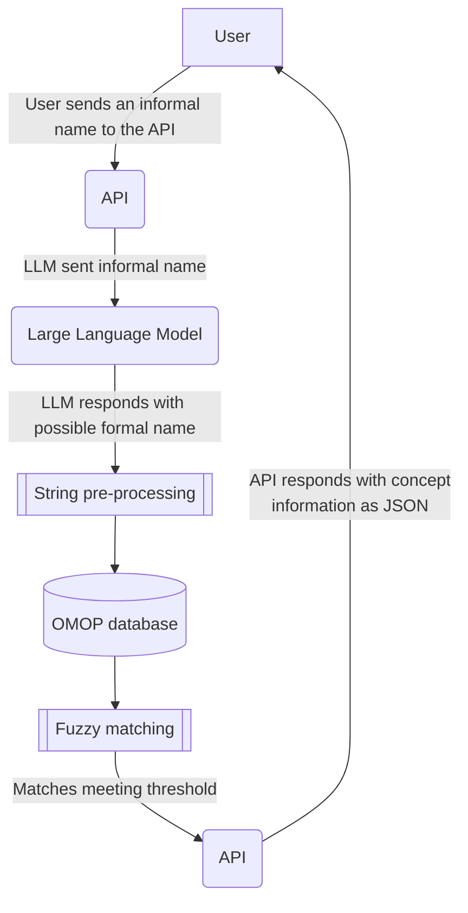

# Lettuce: LLM for Efficient Translation and Transformation into Uniform Clinical Encoding 

**Lettuce** is an application for medical researchers that matches the informal medicine names supplied by the user to concepts in the [Observational Health Data Sciences and Informatics](https://www.ohdsi.org) (OMOP) [standardised vocabularies](https://github.com/OHDSI/Vocabulary-v5.0/wiki)

The application can be used as an API, or run with a graphical user interface (GUI).

   This project is under active development

## Overview

The project uses a Large Language Model to suggest formal drug names to match the informal name supplied by the user. Suggested formal drug names are then fed into parameterised SQL queries against the OMOP database to fetch the relevant concepts. Any returned concepts are then ranked by how well they match the supplied query and provided to the user.

This is the rough process that the Lettuce API follows. Subject to change



## Installation

To use Lettuce, follow [the quickstart](https://health-informatics-uon.github.io/lettuce/quickstart)

### Connecting to a database

Lettuce works by querying a database with the OMOP schema, so you should have access to one. Your database access credentials should be kept in `.env`. An example of the format can be found in `/Lettuce/.env.example`

### Running the API

The simplest way to get a formal name from an informal name is to use the API and the GUI. To start a Lettuce server:

```
$ uv run python app.py
```
The GUI makes calls to the API equivalent to the curl request below.

### Run pipeline

To get a response without the GUI, a request can be made using curl, e.g. for Betnovate scalp application and Panadol

```
$ curl -X POST "http://127.0.0.1:8000/pipeline/" -H "Content-Type: application/json" -d '{"names": ["Betnovate Scalp Application", "Panadol"]}'
```

The API endpoint is `/pipeline/`, and uses a `POST` method

The request body should have the format

```
   {
    "name": <Drug informal name>,
    "pipeline_options": {
      <options>
    }
   }
```

Refer to the [API reference](https://health-informatics-uon.github.io/lettuce/api_reference/options/pipeline_options) for the available pipeline options.

The response will be provided in the format

```
   {
    "event": "llm_output",
    "data": {
       "reply": formal_name: str,
       "meta": LLM metadata: List,
     }
   }

   {
    "event": "omop_output",
    "data": [
       {
         "search_term": search_term: str,
         "CONCEPT": [concept_data: Dict]
       }
     ]
   }
```

The response will be streamed asynchronously so the llm_output will arrive before any omop_output

## Published Images
Development Docker images for the Lettuce project are available on GitHub Container Registry (GHCR):

- **Registry**: `ghcr.io/health-informatics-uon/lettuce`
- **Images**:
  - **Weights Image**: Includes pre-loaded LLaMA-3.1-8B weights.
    - **Tags**:
      - `dev-weights-llama-3.1-8B-sha-<hash>` (e.g., `dev-weights-llama-3.1-8B-sha-a1b2c3d`): Build from a specific commit.
      - `dev-weights-llama-3.1-8B-edge`: Latest development image with weights.
    - **Pull Command**: 
      ```bash
      docker pull ghcr.io/health-informatics-uon/lettuce:dev-weights-llama-3.1-8B-edge
  - **Base Image**: Lightweight image without weights, for custom setups.
    - **Tags**: 
      - `dev-base-sha-<hash>` (e.g., `dev-base-sha-a1b2c3d`): Build from a specific commit.
      - `dev-base-edge`: Latest development image with weights.
    - **Pull Command**: 
      ```bash
      docker pull ghcr.io/health-informatics-uon/lettuce:dev-base-edge
      ```

## Contact

If there are any bugs, please [email us](mailto:james.mitchell-white1@nottingham.ac.uk)
