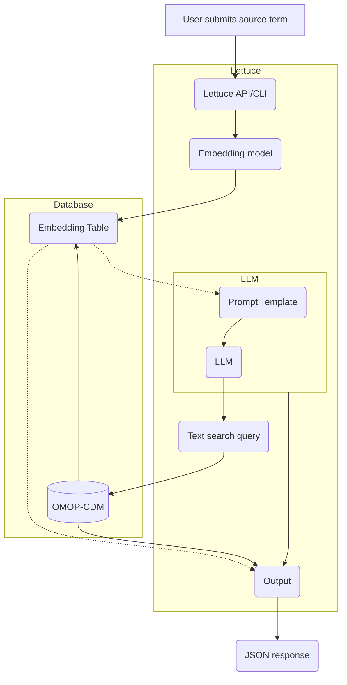

import { Callout } from 'nextra/components'

  

**Lettuce** is an application for medical researchers that matches the informal medicine names supplied by the user to concepts in the [Observational Health Data Sciences and Informatics](https://www.ohdsi.org) (OMOP) [standardised vocabularies](https://github.com/OHDSI/Vocabulary-v5.0/wiki).

The application can be used as an API, or run with a command-line interface (CLI).

<Callout type="warning" emoji="⚠️">
   This project is under active development
</Callout>

## Overview
The project uses a Large Language Model to suggest formal drug names to match the informal name supplied by the user. Suggested formal drug names are then fed into parameterised SQL queries against the OMOP database to fetch the relevant concepts. Any returned concepts are then ranked by how well they match the supplied query and provided to the user.

This is the rough process that the Llettuce API follows. Subject to change

